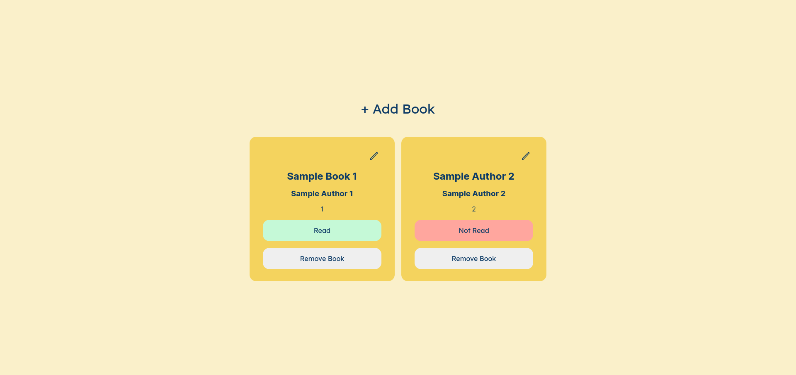

# Library

This is a solution to the [Project: Library](https://www.theodinproject.com/lessons/node-path-javascript-library). The [Odin Project](https://www.theodinproject.com/about) provides a free open source coding curriculum that can be taken entirely online. Since its inception, it has helped many students get hired as developers and has assisted countless others in learning enough programming to work on their own personal projects.

## Overview

### The challenge

Build a Small Library App.

- Utilize the JS Objects methods and properties
- Allow users to add books, remove books, edit the books

### Screenshot

### Links

- Live Site URL: [https://theadg.github.io/admin-dashboard/]

## My Process

### Built with

- Semantic HTML5 markup
- CSS custom properties
- BEM Naming Convention
- Vanilla JS
- SASS
- Flexbox

### What I learned

Understanding the use of objects, prototype and inheritance is an essential part of this project. I have learned more about objects and object constructors and I have to say, they're life changing. I have gotten a grasp of what the _this_ keyword means, hint: it's just contextual. I have also learned more DOM manipulation methods in JS like **.remove()**.

### Continued development

I have more to learn about JS objects. Also, I would love to learn a JS writing style/naming convention for me to have cleaner and better code. I'd would love to improve on my application of the DRY (Do not Repeat Yourself) and KISS (Keep It Simple Stupid) design principles.
